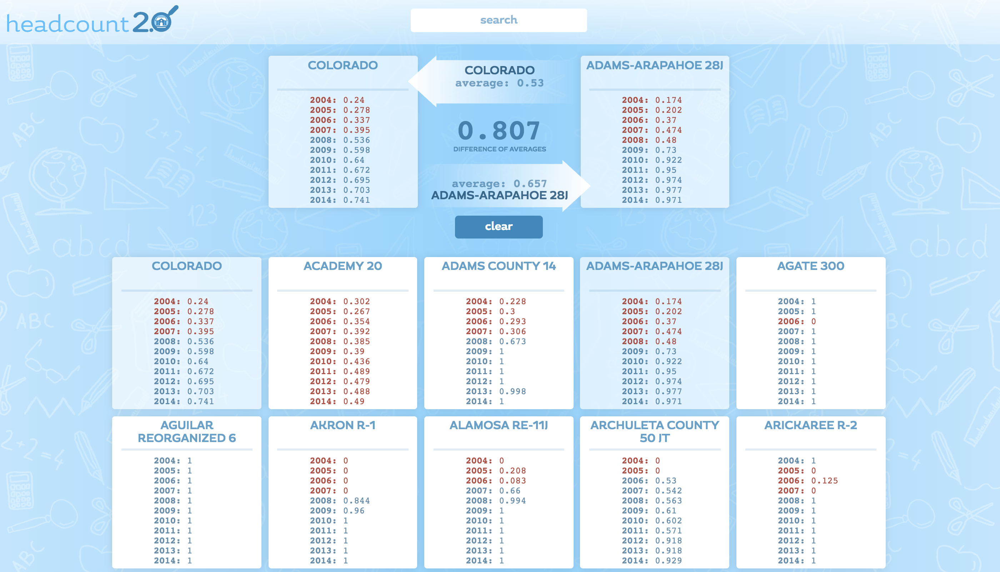

Headcount 2.0 is a pair project created by Rob Morgan and Jason Hughes for Turing School of Software & Design in less than one week.  It is built in React and tested in Jest/Enzyme.

It filters and displays data from Elementary School attendence records in Colorado.  The point of the project was to gain experience working with larger amounts of data and developing React components and Jest tests.

Our allows a user to select various school districts from anywhere in Colorado, automatically displaying and comparing data.  

All artwork is our own and the app works great on all screen sizes.

*******

All data is pulled and formatted on load, creating an easy-to-understand comparison of data for the user.  Cards are automatically added to the comparison section at the top when clicked and compared once there are two cards in place.

